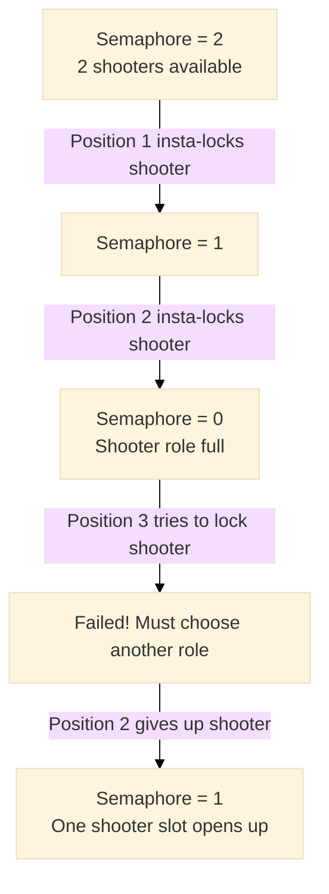
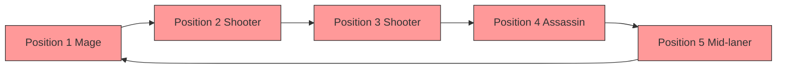

**Introduction**

> "Guys, I'll jungle!"
> As soon as these words are spoken, the Honor of Kings BP (Ban/Pick) interface instantly turns into a battlefield without smoke. Four teammates who want to play mage, one shooter who refuses to switch… In the end, the screen turns gray, and the prompt for [Surrender] or [Remake] is particularly glaring.
>
> As a developer, after countless "prison matches," I suddenly realized: This isn't just a game — this is a perfect depiction of the **critical section, mutual exclusion, and deadlock** taught in operating system class! Today, let's take off our gear, put on our code, and deconstruct the core concepts of concurrent programming using a 5v5 matchup.

## **Chapter 1: The BP Interface — The "Critical Section" Competing for the Unique Hero**

In operating systems, the **critical section** refers to a segment of code that accesses a **shared resource**. This resource has a fatal characteristic: **it can only be occupied by one process at a time**, otherwise it will trigger catastrophic chaos.

In our game, this shared resource is the **hero pool**. More precisely, it's each **unique hero** in the pool. Heroes like `Yao`, `Han Xin`, `Lu Ban No. 7`… these are all unique units of resource. And the moment each player clicks "Lock," they are entering a **critical section of code** that accesses this shared resource.

Why must locking a hero be a critical section? Imagine if there were no rules and two players locked the same hero simultaneously. Could `Yao` appear in the selection boxes of both positions at the same time? Obviously not. The system must guarantee that the "lock" action is **atomic** — meaning it either completes successfully or doesn't happen at all, never in an intermediate state.

To understand why, we must break down the "lock" action. It's far more than a single click. On the server backend, it's a careful **"read-modify-write"** operation:

1. **Read**: Your client queries the server: "Is `Yao` still in the pool?"
2. **Modify**: Based on the query result, your client prepares to add `Yao` to your team's lineup.
3. **Write**: Your client sends an instruction to the server: "Mark our team's `Yao` as locked!"

If multiple people are allowed to perform this operation simultaneously, a **race condition** is triggered, and a silent disaster unfolds.

### **A Disaster: When Two People Insta-Lock "Yao" at the Same Time**

Suppose there's no mutex lock. Process A (Position 1) and Process B (Position 5), both national-level Yao players, press the lock button at the same time.

* **Time T1:** A and B's clients both **read** the hero pool status and delightedly discover: `Yao` is available!
* **Time T2:** A and B both **modify** the data locally, preparing to claim `Yao` for themselves.
* **Time T3:** Due to network fluctuations, B's **write** request reaches the server 1 millisecond faster than A's. The server processes it successfully, assigns `Yao` to Position 5, and updates the global state: `Yao [locked]`.
* **Time T4:** A's write request arrives. Completely unaware of B's action, and still based on the stale data from T1 that `Yao` is available, it sends the instruction to the server: "Position 1 locks `Yao`."

**Outcome:**
The server is caught in a dilemma. It might:
1. **Data Overwrite**: Accept A's request, using Position 1's `Yao` to overwrite Position 5's `Yao`. The Position 5 player watches helplessly as their chosen hero disappears, being kicked by the system to fill another role. **(Lost Update)**
2. **System Crash**: Unable to handle this fundamental contradiction, the BP interface freezes or data becomes corrupted. **(Data Inconsistency)**

Either outcome is a catastrophic program error.

### **The Correct Rule: Adding a "Lock" to Each Hero**

<details> <summary> Click to expand: Pseudo-code demonstrating Honor of Kings PV operations</summary>

```python
# P operation: Request resource (equivalent to "trying to insta-lock a hero")
def P(hero):
    if hero.locked:  # If someone has already insta-locked it
        print(f"{hero.name} has already been locked by a teammate. You must wait or switch heroes.")
        return False
    else:  # If no one has selected it
        hero.locked = True
        print(f"Successfully locked {hero.name}!")
        return True

# V operation: Release resource (equivalent to "cancelling selection, hero returns to the pool")
def V(hero):
    if hero.locked:  
        hero.locked = False
        print(f"{hero.name} has been released. Now others can select it too.")
    else:
        print(f"{hero.name} wasn't locked by anyone, no need to release.")

# Example
class Hero:
    def __init__(self, name):
        self.name = name
        self.locked = False

Yao = Hero("Yao")
# Player in Position 1
P(Yao)   # Output: Successfully locked Yao!
# Player in Position 5 tries again
P(Yao)   # Output: Yao has already been locked by a teammate. You must wait or switch heroes.
# Position 1 cancels selection
V(Yao)   # Output: Yao has been released. Now others can select it too.
# Position 5 tries again
P(Yao)   # Output: Successfully locked Yao!
```

In this code:
- P(hero) = Player clicks the "Lock" button.
- V(hero) = Player clicks the "Cancel Selection" button.
</details>

To avoid this disaster, the system sets up a **mutex lock** for **each and every hero**.

1. **Process A (Position 1)** clicks lock on `Yao`. Its request arrives at the server first.
2. The server immediately checks `Yao`'s lock. Finding it free, it **grants the lock to A** and immediately marks `Yao` as "pre-selected" (or directly locked), simultaneously broadcasting to all players: "Position 1 has chosen Yao." **From this point on, the lock on `Yao` is held by A.**
3. **Process B (Position 5)** clicks lock on `Yao` at almost the same time. Its request arrives slightly later.
4. The server checks `Yao`'s lock, finds it held by A, so it **immediately and resolutely rejects B's request**. On B's client, `Yao`'s icon will immediately turn gray (or be clearly indicated as unselectable), and their lock operation won't be executed at all. **B is blocked outside the critical section.**
5. **Process A's** lock operation is safely finalized. `Yao` officially belongs to Position 1.
6. The server **releases** `Yao`'s lock (though at this point it's irrelevant since the hero is already assigned).
7. **Process B** can only choose again from the remaining heroes.

**What if A changes their mind?**
If after pre-selecting, A cancels `Yao` (e.g., switching to another hero), that's equivalent to **actively releasing the lock**. The server will mark `Yao` as available again, and then B can successfully acquire the lock and pre-select her.

### **Core Conclusion**

> **It must be ensured that one process's "read-modify-write" operation sequence on a shared resource (a specific hero) is executed as an indivisible atomic unit. During this process, a mutex lock prohibits any other process from accessing the same resource.**

The seemingly simple action of "locking a hero" is one of the most classic critical section problems in concurrent programming. And the mutex lock is the cold, impartial referee that ensures everything is foolproof and maintains ultimate data consistency.

## **Chapter 2: How to Avoid Conflict — "In-Game Voice Chat" in Operating Systems**

In games, we communicate through typing and voice: "I'll jungle," "Someone play support." In operating systems, this is called **inter-process communication**.

The system itself also has more low-level mechanisms to ensure mutual exclusion, such as:

* **Mutex Lock**: It's like a unique key. The first player to pre-select the jungle role essentially gets the key (acquires the lock). Other players who want to jungle see "position taken" (fail to acquire the lock) and must wait.
* **Semaphore**: It's like a counter. The system stipulates "at most 2 players can play the shooter role" (semaphore initial value is 2). Each time a player selects a shooter, the counter decrements by 1. When the counter reaches 0, the next player trying to select a shooter will be blocked by the system until someone gives it up.



These mechanisms are like the rules and communication channels within the game, striving to resolve conflicts before they happen.

## **Chapter 3: Deadlock — When Five People Refuse to Back Down**

The worst-case scenario occurs: no support, no jungle, all five players insta-lock carry roles, and none of them are willing to yield.

At this moment, **deadlock** occurs.

Deadlock in operating systems has four necessary conditions, and we perfectly replicated them in the game:

1. **Mutual Exclusion**: Hero/role resources are exclusive (a position can only have one hero).
2. **Hold and Wait**: Each player holds onto the hero they've currently selected, while simultaneously waiting for teammates to give up the roles they want.
3. **No Preemption**: The system cannot forcibly kick a hero that a player has already locked (resources cannot be forcibly preempted).
4. **Circular Wait**: Player A waits for B to switch, B waits for C to switch, C waits for A to switch… forming a painful waiting cycle.



There's only one outcome: **the system detects a timeout or an extremely unreasonable lineup and forcibly disbands the match, sending everyone back to the lobby.** In operating systems, this is **deadlock recovery** — forcibly terminating all processes and reclaiming resources.

## **Chapter 4: More Than Just a Game — A Philosophical Extension**

Once we understand these concepts, looking back at scheduling algorithms, we find they seem to represent different philosophies for managing this "team":

* **FCFS (First-Come, First-Served)**: It's **conservatism**, rigidly adhering to the "first come, first served" rule.
* **SJF (Shortest Job First)**: It's **utilitarianism**. In order to win quickly (short tasks), it always lets the mage and shooter get the minion wave gold first.
* **RR (Round Robin)**: It's **egalitarianism**. The jungler helps all three lanes in turn, ensuring no one gets shortchanged.
* **Priority**: It's **elitism/caste system**, always "protecting the shooter" while other roles fend for themselves.

## **Conclusion**

> You see, computer science isn't always about boring 0s and 1s. Its core ideas are hidden in our daily entertainment, collaboration, and even conflicts. **Concurrency control is essentially the art of managing how a group of selfish individuals (processes) can safely, efficiently, and fairly share limited resources (CPU, memory, hero positions).**
>
> I hope that next time you find yourself in a "prison match" due to a problematic lineup, you can smile knowingly and think, "Oh, we just experienced a classic deadlock." Then, proactively take out your Zhang Fei or Niu Mo, becoming the "system daemon" that breaks the **circular wait** and resolves the deadlock.
