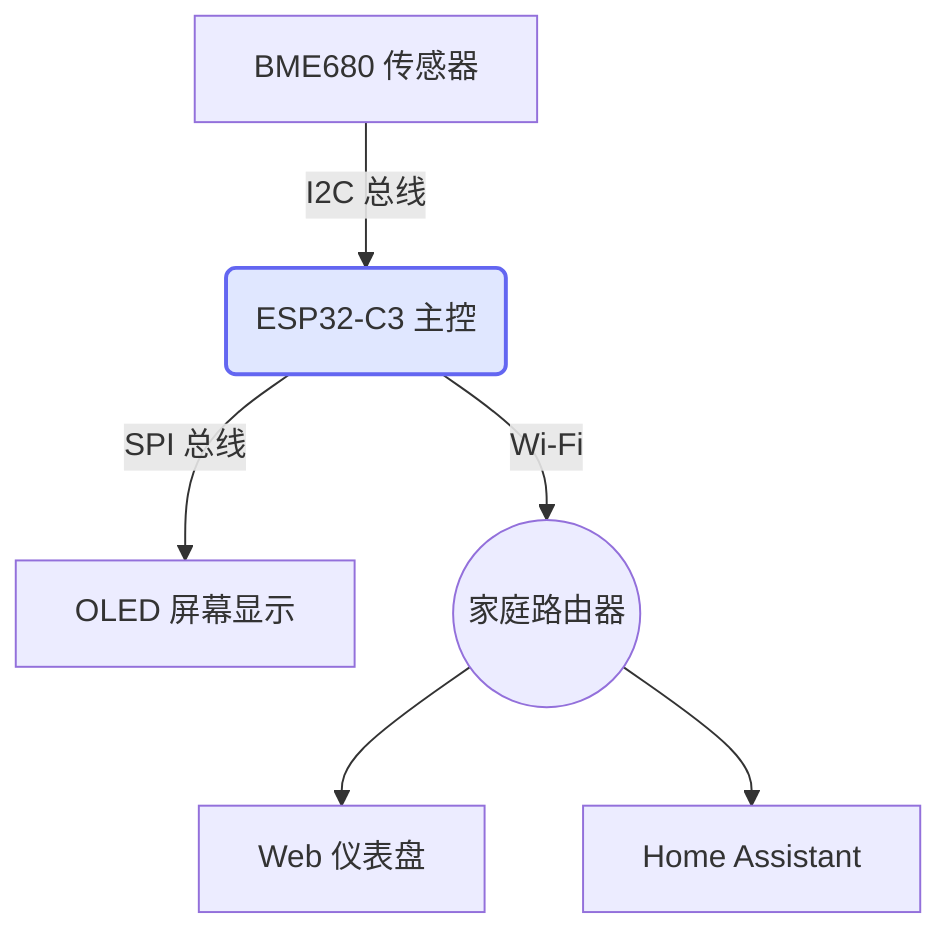

# 为什么要做这个项目？

在日常生活中，我们经常需要了解室内的温湿度以及空气质量情况。虽然市面上有许多现成的产品，但作为一个喜欢折腾的开发者，我决定自己动手做一个完全可控、支持本地局域网并且能接入 Home Assistant 的监测站。

"硬件的魅力在于，你写下的每一行代码，最终都会变成物理世界中跳动的电子信号。" —— CYX

## 预期目标

实时监测温度、湿度、TVOC (总挥发性有机化合物)。

搭载一块 1.3 寸的 OLED 屏幕用于本地数据显示。

通过 Web Server 提供数据接口。

# 硬件与软件架构

为了保证系统的稳定性和低功耗，我选择了 ESP32-C3 作为主控芯片。下面是整个系统的数据流转架构图：



## 传感器校准算法

在读取 BME680 的原始数据时，我们需要进行一定的环境补偿。根据官方数据手册，温度的近似补偿公式可以表示为：

$$T_{comp} = T_{raw} \times \alpha + \beta \cdot \ln(R_{gas})$$

利用这个公式，我们可以把测量误差控制在 $\pm 0.5^\circ C$ 以内。

<!-- tab: 核心实现逻辑 -->

下面是连接 Wi-Fi 以及初始化 Web Server 的核心 C++ (Arduino) 代码。在这个模块中，我使用了非阻塞的方式进行网络重连：

```C++
#include <WiFi.h>
#include <WebServer.h>

const char* ssid = "YOUR_SSID";
const char* password = "YOUR_PASSWORD";
WebServer server(80);

void setupWiFi() {
    WiFi.begin(ssid, password);
    Serial.print("Connecting to WiFi");
    
    // 非阻塞等待，并带超时机制
    int retries = 0;
    while (WiFi.status() != WL_CONNECTED && retries < 20) {
        delay(500);
        Serial.print(".");
        retries++;
    }
    
    if (WiFi.status() == WL_CONNECTED) {
        Serial.println("\nConnected! IP: " + WiFi.localIP().toString());
    } else {
        Serial.println("\nFailed to connect.");
    }
}

void setup() {
    Serial.begin(115200);
    setupWiFi();
    
    server.on("/api/data", []() {
        server.send(200, "application/json", "{\"temp\": 25.4, \"humidity\": 60}");
    });
    server.begin();
}
```

<!-- tab: 开发过程中遇到的坑 -->

在调试 I2C 总线的时候，传感器死活读不出数据。最后排查发现是因为上拉电阻的问题。

起初我以为是 ESP32 的引脚烧了，于是我写了一段 I2C Scanner 的代码来扫描总线地址：

```C++
// 扫描 I2C 设备的简易代码
byte error, address;
for(address = 1; address < 127; address++ ) {
  Wire.beginTransmission(address);
  error = Wire.endTransmission();
  if (error == 0) {
    Serial.print("I2C device found at address 0x");
    Serial.println(address, HEX);
  }
}
```

扫描结果全空。最后我翻阅电路图，发现自己忘记给 SCL 和 SDA 加上 4.7k 的上拉电阻。焊上电阻后，0x77 地址瞬间就被扫描出来了，大功告成！

<!-- tab: 后续改进计划 -->

设计 3D 打印外壳。

加入光敏传感器，实现屏幕亮度的自适应调节。