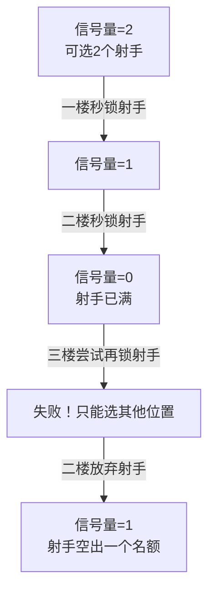

# 从王者荣耀的BP界面理解操作系统的临界区与死锁

**引言**

> “兄弟们，我打野！”
> 这句话一出，王者荣耀的BP（Ban/Pick）界面瞬间变成了一个没有硝烟的战场。四个想玩法师的队友，一个不肯换的射手… 最后屏幕一灰，【投降】或【重开】的提示格外刺眼。
>
> 作为一名开发者，我在无数次“坐牢局”后突然意识到：这哪里是游戏，这分明就是操作系统课上讲的**临界区、互斥和死锁**的完美写照！今天，就让我们脱下装备，换上代码，用一场5v5的对抗来解构并发编程中最核心的概念。

## **第一章：BP界面——那个争夺唯一英雄的“临界区”**

在操作系统中，**临界区**指的是一段访问**共享资源**的代码。这段资源有一个致命特性：**一次只能被一个进程占用**，否则就会引发灾难性的混乱。

在我们的游戏里，这个共享资源就是**英雄池**。更准确地说，是池中的每一个**独一无二的英雄**。`瑶`、`韩信`、`鲁班七号`... 这些英雄都是唯一的资源单位。而每个玩家点击“锁定”的那一刻，就是在进入一段访问这个共享资源的**临界区代码**。

为什么锁定英雄必须是临界区？想象一下，如果没有规则，两个玩家同时锁定了同一个英雄会发生什么？`瑶`难道能同时出现在两个楼层的选择框里吗？这显然不可能。系统必须保证“锁定”这个动作是**原子性**的——即要么成功完成，要么完全不发生，绝不能处于中间状态。

为了理解为什么，我们必须拆解“锁定”这个动作。它远不止一个点击，在服务器后端，它是一次小心翼翼的“**读-改-写**”操作：

1. **读**：你的客户端向服务器查询：“`瑶`还在池子里吗？”
2. **改**：你的客户端基于查询结果，准备将`瑶`添加到你的队伍阵容中。
3. **写**：你的客户端向服务器发送指令：“把我方的`瑶`标记为已锁定！”

如果允许多人同时进行这个操作，就会触发**竞态条件**，一场无声的灾难就此上演。

---

### **一场灾难：当两个人同时秒锁“瑶”**

假设没有互斥锁，进程A（一楼）和进程B（五楼）两个国服瑶玩家同时按下了锁定按钮。

* **时刻 T1:** A和B的客户端都**读取**了英雄池状态，欣喜地发现：`瑶`可用！
* **时刻 T2:** A和B都在本地**修改**数据，准备将`瑶`据为己有。
* **时刻 T3:** 由于网络波动，B的**写入**请求比A的快了1毫秒到达服务器。服务器成功处理，将`瑶`分配给了五楼，并更新全局状态：`瑶[已锁定]`。
*   **时刻 T4:** A的写入请求随后到达。它完全不知道B的操作，依然基于T1时刻“`瑶`可用”的陈旧数据，向服务器发出了“一楼锁定`瑶`”的指令。

**结局：**
服务器陷入了两难。它可能：
1. **数据覆盖**：接受A的请求，用一楼的`瑶`覆盖掉五楼的`瑶`。五楼玩家眼睁睁看着自己选好的英雄消失，被系统踢去补位。**(丢失更新)**
2. **系统崩溃**：无法处理这种根本性的矛盾，导致BP界面卡死或数据错乱。**(数据不一致)**

无论哪种，都是毁灭性的程序错误。

---

### **正确的法则：为每个英雄加上“锁”**

<details>
<summary>点击展开：伪代码演示王者荣耀PV操作</summary>

```python
# P操作：请求资源（相当于“尝试秒锁英雄”）
def P(hero):
    if hero.locked:  # 如果已经有人秒锁了
        print(f"{hero.name} 已经被队友锁定了，你只能等或换英雄。")
        return False
    else:  # 如果没人选
        hero.locked = True
        print(f"成功锁定 {hero.name}！")
        return True

# V操作：释放资源（相当于“取消选择，英雄重新回到池子里”）
def V(hero):
    if hero.locked:  
        hero.locked = False
        print(f"{hero.name} 已释放，现在别人也能选啦。")
    else:
        print(f"{hero.name} 本来就没人锁，不需要释放。")

# 示例
class Hero:
    def __init__(self, name):
        self.name = name
        self.locked = False

瑶 = Hero("瑶")
# 一楼玩家
P(瑶)   # 输出：成功锁定 瑶！
# 五楼玩家再试
P(瑶)   # 输出：瑶 已经被队友锁定了，你只能等或换英雄。
# 一楼取消选择
V(瑶)   # 输出：瑶 已释放，现在别人也能选啦。
# 五楼再次尝试
P(瑶)   # 输出：成功锁定 瑶！
```
这个代码里：
- P(hero) = 玩家点击“锁定”按钮。
- V(hero) = 玩家点击“取消选择”。



为了避免这场灾难，系统为**每一个英雄**都设置了一把**互斥锁**。

1. **进程A（一楼）** 点击锁定`瑶`。它的请求率先到达服务器。
2. 服务器立即检查`瑶`的锁。发现是自由的，于是**将锁授予A**，并立刻将`瑶`标记为“预选中”（或直接锁定），同时广播通知所有玩家：“一楼选择了瑶”。**从此，`瑶`这把锁就被A持有了。**
3. **进程B（五楼）** 几乎同时点击锁定`瑶`。它的请求稍后到达。
4. 服务器检查`瑶`的锁，发现已被A持有，于是**立刻、坚决地拒绝B的请求**。B的客户端上，`瑶`的头像会立刻变灰（或被明确提示无法选择），他的锁定操作根本不会被执行。**B被阻塞在了临界区之外。**
5. **进程A** 的锁定操作被安全地最终化。`瑶`正式归属一楼。
6. 服务器**释放**`瑶`的锁（但此时释放已无关紧要，因为英雄已分配）。
7. **进程B** 只能从剩下的英雄中重新选择。

**如果A反悔了？**
如果A在预选后取消了`瑶`（比如换了另一个英雄），这就相当于**主动释放了锁**。服务器会将`瑶`重新标记为可用，这时B就可以成功获得锁并预选她。

---

### **核心结论**

> **必须保证一个进程对共享资源（某个特定英雄）的“读-改-写”操作序列，作为一个不可分割的原子单元执行。在此过程中，通过互斥锁禁止其他任何进程访问同一资源。**

“锁定英雄”这个看似简单的动作，是并发编程中一个最经典的临界区问题。而互斥锁，就是那位确保万无一失、维护数据最终一致性的冷酷裁判。

## **第二章：如何避免冲突——操作系统里的“队内语音”**

游戏里，我们通过打字、语音来沟通：“我玩打野”、“来个辅助”。这在操作系统里叫**进程间通信**。

而系统自身也有更底层的机制来保证互斥，比如：

* **互斥锁**：就像一把唯一的钥匙。第一个预选打野位的玩家相当于拿到了钥匙（获取锁），其他想玩打野的玩家看到的是“位置已被占用”（申请锁失败），必须等待。
* **信号量**：像一个计数器。系统规定“最多只能有2个射手位”（信号量初始值为2）。每有一个玩家选择射手，计数器就减1。当计数器为0时，下一个想选射手的玩家就会被系统阻止，直到有人放弃。



这些机制就像游戏内的规则和沟通渠道，努力在冲突发生前化解它。

## **第三章：死锁——当五个人都拒绝退让**

最坏的情况还是发生了：没人辅助，没人打野，五个人都秒锁了C位，并且全都毫不退让。

这一刻，**死锁**发生了。

操作系统中的死锁有四个必要条件，我们在游戏里完美复刻了它们：

1. **互斥条件**：英雄/位置资源是独占的（一个位置只能有一个英雄）。
2. **请求与保持条件**：每个玩家都占着自己当前选择的英雄，同时又都在等待队友放弃他们想要的位置。
3. **不剥夺条件**：系统不能强制把一个玩家已经锁定的英雄给踢掉（资源不可强行剥夺）。
4. **循环等待条件**：玩家A在等B换，B在等C换，C又在等A换… 形成了一个痛苦的等待环。


graph LR
    A[一楼法师] --> B[二楼射手]
    B --> C[三楼射手]
    C --> D[四楼刺客]
    D --> E[五楼中单]
    E --> A
    style A fill:#f99,stroke:#333
    style B fill:#f99,stroke:#333
    style C fill:#f99,stroke:#333
    style D fill:#f99,stroke:#333
    style E fill:#f99,stroke:#333


结局只有一个：**系统检测到超时或阵容极度不合理，强制解散对局，所有人退回大厅**。这在操作系统里属于**死锁恢复**——强行终止所有进程，回收资源。

## **第四章：不仅仅是游戏——一场哲学的延伸**

当我们理解了这些概念，再回头看调度算法，会发现它们仿佛是管理这个“团队”的不同哲学：

* **FCFS（先来先服务）**：是**保守主义**，死板地遵守“先来后到”的规则。
* **SJF（短作业优先）**：是**功利主义**，为了快速赢（短任务），永远让法师射手先吃线。
* **RR（时间片轮转）**：是**平等主义**，打野轮流帮三路，谁都不吃亏。
* **Priority（优先级调度）**：是**精英主义/种姓制度**，永远“保射手”，其他位置自生自灭。

## **结语**

> 你看，计算机科学并非总是枯燥的0和1。它的核心思想，就隐藏在我们日常的娱乐、协作甚至冲突之中。**并发控制，本质上是关于如何让一群自私的个体（进程）安全、高效、公平地共享有限资源（CPU、内存、英雄位）的艺术。**
>
> 希望你在下一局游戏因为阵容问题而“坐牢”时，能会心一笑：“哦，我们刚刚经历了一次经典的死锁。” 然后，主动拿出你的张飞牛魔，成为那个打破**循环等待**、解开死锁的“系统守护进程”。